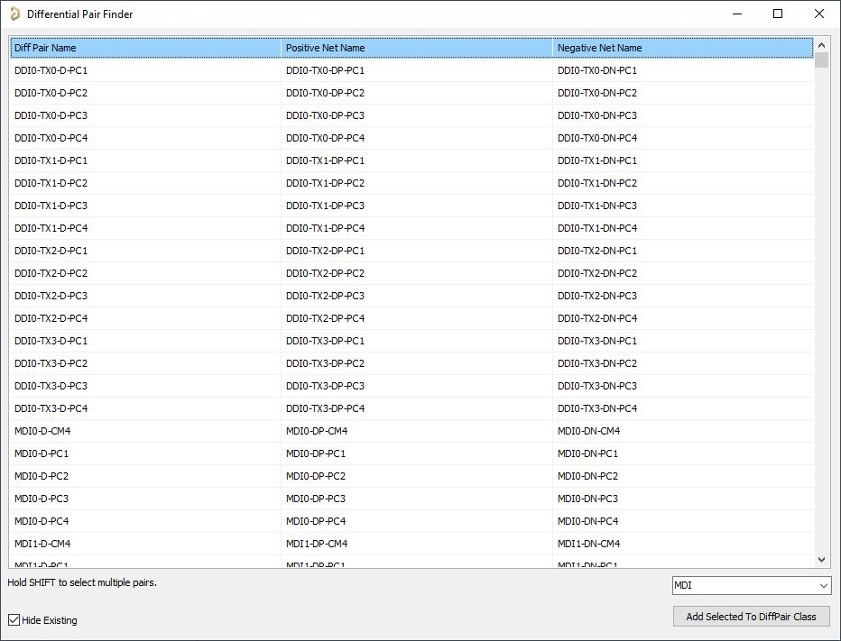

# Differential Pair Finder

## Overview
Finds diff pairs in layout by filtering through net names. It will also find non-obvious nets by looking for pairs that connect through resistors and capacitors.

## Usage
Run with or without a GUI. In GUI mode, you can add pairs to a selected class or enter a new class name. If you run without a GUI it will just add all pairs to the `All Differential Pairs` class.

## Credits
- From the Altium Script Examples: Matt Berggren & David Parker's PCB_Class_Generator_Form.pas on how to add classes and nets to classes
- GPT4o